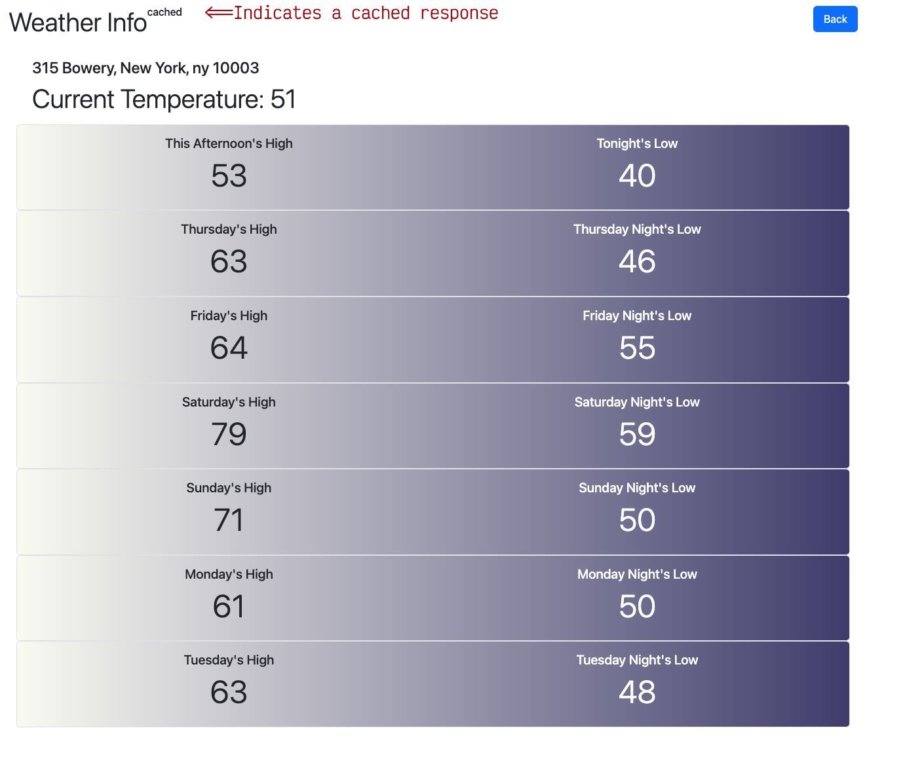

# Weather Info Application

**Apple (ruby-code-assessment-4)**
- Rails 8 app for retrieving and displaying weather information by address.
- The CensusGovService class (`app/services/census_gov_service.rb`) uses Census data to get coordinates from address ([geocoding.geo.census.gov](https://geocoding.geo.census.gov/geocoder/locations/address?street=%20315%20Bowery&city=new%20york&state=NY&zip=10006&benchmark=Public_AR_Current&format=json))
- The NationWeatherService class (`app/services/national_weather_service.rb`) uses the National Weather Service for forecast data ([api.weather.gov](https://api.weather.gov/gridpoints/OTX/149,57/forecast))
- Caches National Weather Service requests by ZIP for 30 minutes.

<div style="margin-left: 40px">
   
</div>


## Prerequisites

- Ruby 3.4.2
- Node.js 20.11.1
- Yarn
- SQLite3

## Getting Started

### Local Development Setup

1. **Clone the repository**

   ```bash
   git clone https://github.com/yourusername/weather-info.git
   cd weather-info
   ```

2. **Install Ruby dependencies**

   ```bash
   bundle install
   ```

3. **Install JavaScript dependencies**

   ```bash
   yarn install
   ```

4. **Set up the database**

   ```bash
   bin/rails db:create
   bin/rails db:migrate
   bin/rails db:seed  # if seed data is available
   ```

5. **Start the Rails server with frontend compilation**

   ```bash
   bin/dev  # This uses the Procfile.dev configuration
   ```

   Alternatively, you can run each process separately:

   ```bash
   # In separate terminal windows:
   bin/rails server
   yarn build:css --watch
   yarn build --watch
   ```

6. **Access the application**

   Open your browser and navigate to `http://localhost:3000`

### Running Tests

```bash
bundle exec rspec     # for RSpec tests
```

## Docker Deployment

The application includes Docker configuration for production deployment. The Dockerfile is configured to build a fully functional container with no additional configuration beyond providing the Rails master key.

### Check if Docker is installed

To verify if Docker is installed on your machine, open a terminal and run:

```bash
docker --version
```

If Docker is installed, you'll see output similar to:
```
Docker version 24.0.6, build f1bf695
```

If the command is not found, you'll need to [install Docker](https://docs.docker.com/get-docker/) before proceeding.

### Building and Running with Docker

1. **Build the Docker image**
   \** *from the project's root directory* \**

   ```bash
   docker build -t weather_info .
   ```

2. **Run the container**

   ```bash
   docker run -d -p 8080:3000 -e RAILS_MASTER_KEY=4e143cd0f4efe28cb63f436ec7626574 --name weather_info weather_info
   ```

   The master key can be found in the `config/master.key` file.
   ***Note: (This file/secret should not be committed to Git in any other scenario...I have included it for ease of assessment).***

   <br>

   **Note on Environment and Configuration**: 
   
   * The container is configured to run in production mode automatically
   * No additional configuration is needed beyond the RAILS_MASTER_KEY
   * The container exposes port 3000 internally (mapped to 8080 on the host in the example above)

   <br>

   **Automatic Database Setup**: 
   
   The container automatically sets up the database during container startup via the entrypoint script. Each time the container starts:

   1. The database is reset (dropped and recreated) with `db:reset`
   2. Migrations are run with `db:migrate` 
   3. Schema version is verified with `db:version`

   You can verify this is happening by checking the logs:

   ```bash
   docker logs weather_info
   ```

   You should see output similar to:

   ```
   RUN SECRET_KEY_BASE_DUMMY=1 ./bin/rails db:create db:schema:load db:migrate...2.1s
     Created database 'storage/production_cable.sqlite3'
     (0.9ms) DROP TABLE IF EXISTS "locations"
     (6.3ms) CREATE TABLE "locations" ("id" integer PRIMARY KEY AUTOINCREMENT NOT NULL, "latitude" float, "longitude" float, "street" varchar, "city" varchar, "state" varchar, "zip" varchar, "created_at" datetime(6) NOT NULL, "updated_at" datetime(6) NOT NULL)
     (0.3ms) CREATE TABLE "schema_migrations" ("version" varchar NOT NULL PRIMARY KEY)
   ```

   **Important**: The database is reset each time the container starts. This is appropriate for this assessment application but may not be desired in actual production deployments.

   <br>

3. **Managing Docker containers**

   If you need to stop and remove a previously created container with the same name:

   ```bash
   # Stop the container
   docker stop weather_info

   # Remove the container
   docker rm weather_info
   ```

4. **Verify container status**

   Check if the container is running properly:

   ```bash
   docker ps | grep weather_info
   ```

   You should see output showing the container running with port 8080 mapped to container port 3000.

5. **View container logs**

   If you encounter issues, check the container logs:

   ```bash
   docker logs weather_info

   # To follow log output in real-time
   docker logs -f weather_info
   ```

6. **Access the application**

   Open your browser and navigate to `http://localhost:8080`

## Technology Stack

- **Backend**: Rails 8.0.2
- **Database**: SQLite3
- **Frontend**: Bootstrap 5, PostCSS
- **Testing**: RSpec, VCR for HTTP mocking
- **Deployment**: Docker

## Docker Troubleshooting

If you encounter issues with Docker deployment, try these troubleshooting steps:

1. **Port conflicts**: If port 8080 is already in use, you can map to a different port:

   ```bash
   docker run -d -p 9000:3000 -e RAILS_MASTER_KEY=4e143cd0f4efe28cb63f436ec7626574 --name weather_info weather_info
   ```

2. **Database setup issues**: If you encounter database-related errors, you can force a rebuild of the Docker image:

   ```bash
   docker build --no-cache -t weather_info .
   ```

3. **Browser access issues**: If you can't access the application in your browser but `curl` works:

   ```bash
   curl -v http://localhost:8080/
   ```

   - Try clearing your browser cache
   - Try a different browser
   - Try accessing via IP address, e.g., `http://127.0.0.1:8080`
   - Ensure no firewall or security software is blocking the connection

4. **Explicitly force binding to all interfaces**:

   ```bash
   docker run -d -p 8080:3000 -e RAILS_MASTER_KEY=4e143cd0f4efe28cb63f436ec7626574 -e BINDING=0.0.0.0 --name weather_info weather_info
   ```

## Known Issues
- census.gov was chosen for my geocoding service because it is free and needs no account/authentication. Having said that, it can be a little flakey and won't always return geocoding records for legitimate addresses. 
